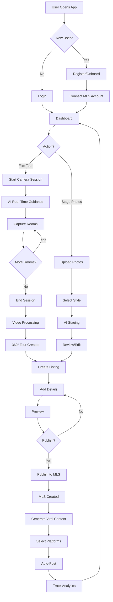

# RealTour360 - Complete System Architecture Blueprint
## AI-Powered 360° Real Estate Platform

**Version:** 1.0  
**Status:** Production-Ready Architecture  
**Last Updated:** January 2025

---

## Table of Contents

1. [System Overview](#system-overview)
2. [Architecture Design](#architecture-design)
3. [360° Camera AI Direction System](#360-camera-ai-direction-system)
4. [AI Virtual Staging Engine](#ai-virtual-staging-engine)
5. [MLS Integration System](#mls-integration-system)
6. [Viral Social Media Engine](#viral-social-media-engine)
7. [Database Schema](#database-schema)
8. [API Routes](#api-routes)
9. [AI Agents & Components](#ai-agents--components)
10. [User Flow](#user-flow)
11. [Security Architecture](#security-architecture)
12. [Technology Stack](#technology-stack)
13. [MVP Build Instructions](#mvp-build-instructions)
14. [Deployment Guide](#deployment-guide)

---

## System Overview

### Vision
RealTour360 is an end-to-end AI-powered platform that revolutionizes real estate marketing by automating 360° tours, AI staging, MLS synchronization, and viral content distribution.

### Core Features
- **AI-Guided Filming:** Real-time direction during 360° capture
- **Intelligent Staging:** Auto-detect empty rooms and add virtual furniture
- **MLS Auto-Sync:** Direct integration with major MLS providers
- **Viral Content Generation:** Auto-create and post short-form content
- **Complete Automation:** Film → Stage → List → Market

### Key Metrics
- **Time to Market:** 15 minutes (vs 3-5 days traditional)
- **Cost Savings:** 90% reduction in staging costs
- **Reach Amplification:** 10x through automated multi-platform posting
- **Quality:** Professional-grade 4K output

---

## Architecture Design

### High-Level Architecture

```
┌─────────────────────────────────────────────────────────────┐
│                    CLIENT APPLICATIONS                       │
├─────────────┬──────────────┬─────────────┬─────────────────┤
│  Mobile App │   Web App    │  360° Cam   │   Admin Panel   │
│  (iOS/Andr) │   (React)    │  Interface  │   (Dashboard)   │
└──────┬──────┴──────┬───────┴──────┬──────┴────────┬─────────┘
       │             │              │               │
       └─────────────┴──────────────┴───────────────┘
                            │
                ┌───────────▼───────────┐
                │    API GATEWAY        │
                │   (Kong/Nginx)        │
                └───────────┬───────────┘
                            │
        ┌───────────────────┼───────────────────┐
        │                   │                   │
┌───────▼────────┐  ┌───────▼────────┐  ┌──────▼─────────┐
│  CORE BACKEND  │  │  AI SERVICES   │  │  MEDIA PROC    │
│   (FastAPI)    │  │   (Python)     │  │   (Node.js)    │
└───────┬────────┘  └───────┬────────┘  └──────┬─────────┘
        │                   │                   │
        └───────────────────┼───────────────────┘
                            │
        ┌───────────────────┼───────────────────┐
        │                   │                   │
┌───────▼────────┐  ┌───────▼────────┐  ┌──────▼─────────┐
│   DATABASES    │  │  QUEUE/CACHE   │  │  FILE STORAGE  │
│ MongoDB+Redis  │  │  Redis/RabbitMQ│  │  S3/MinIO      │
└────────────────┘  └────────────────┘  └────────────────┘
        │                   │                   │
        └───────────────────┼───────────────────┘
                            │
        ┌───────────────────┼───────────────────┐
        │                   │                   │
┌───────▼────────┐  ┌───────▼────────┐  ┌──────▼─────────┐
│  MLS SYSTEMS   │  │ SOCIAL PLATFORMS│ │  AI MODELS     │
│ (External APIs)│  │ (External APIs) │ │  (OpenAI/etc)  │
└────────────────┘  └─────────────────┘ └────────────────┘
```

### Microservices Architecture

```
RealTour360/
├── services/
│   ├── api-gateway/          # Entry point, routing, auth
│   ├── camera-director/      # Real-time AI filming guidance
│   ├── video-processor/      # 360° stitching, stabilization
│   ├── ai-staging/           # Virtual furniture placement
│   ├── mls-integration/      # MLS sync service
│   ├── viral-generator/      # Social content creation
│   ├── social-poster/        # Multi-platform posting
│   └── analytics/            # Usage tracking, metrics
├── ai-models/
│   ├── director-model/       # Filming guidance AI
│   ├── staging-model/        # Furniture placement AI
│   ├── quality-checker/      # Image quality assessment
│   └── content-optimizer/    # Viral content optimizer
├── workers/
│   ├── video-worker/         # Background video processing
│   ├── staging-worker/       # Background staging jobs
│   └── posting-worker/       # Scheduled social posts
└── shared/
    ├── database/             # Database models
    ├── utils/                # Common utilities
    └── config/               # Configuration
```

---

## 360° Camera AI Direction System

### Overview
Real-time AI that guides users during filming with voice/visual cues, quality checks, and automatic corrections.

### Architecture Components

#### 1. **Live Stream Processor**
```python
# camera-director/stream_processor.py

class LiveStreamProcessor:
    """
    Processes live 360° camera feed in real-time
    """
    
    def __init__(self):
        self.frame_buffer = deque(maxlen=30)  # 1 second at 30fps
        self.ml_model = load_director_model()
        self.quality_checker = QualityChecker()
        
    async def process_frame(self, frame: np.ndarray) -> DirectionCommand:
        """
        Analyze each frame and generate guidance
        """
        # Add to buffer
        self.frame_buffer.append(frame)
        
        # Run ML inference
        analysis = await self.ml_model.analyze(frame)
        
        # Quality checks
        quality_issues = self.quality_checker.check(frame)
        
        # Generate command
        command = self._generate_command(analysis, quality_issues)
        
        return command
    
    def _generate_command(self, analysis, issues) -> DirectionCommand:
        """
        Convert analysis to user-friendly command
        """
        commands = []
        
        # Movement guidance
        if analysis['movement_speed'] > THRESHOLD:
            commands.append("Slow down - pan more slowly")
        
        # Positioning
        if analysis['camera_tilt'] < -10:
            commands.append("Tilt camera up slightly")
        
        # Quality issues
        if 'blur' in issues:
            commands.append("Hold steady - image is blurry")
        
        if 'dark' in issues:
            commands.append("Move to brighter area or turn on lights")
        
        # Coverage tracking
        coverage = self._check_room_coverage(analysis)
        if coverage < 0.8:
            commands.append(f"Coverage: {coverage*100:.0f}% - capture missing areas")
        
        return DirectionCommand(
            primary=commands[0] if commands else "Good - continue",
            secondary=commands[1:],
            quality_score=analysis['quality_score'],
            coverage_percent=coverage * 100
        )
```

#### 2. **Quality Checker**
```python
class QualityChecker:
    """
    Real-time quality assessment
    """
    
    def check(self, frame: np.ndarray) -> List[str]:
        issues = []
        
        # Blur detection (Laplacian variance)
        gray = cv2.cvtColor(frame, cv2.COLOR_BGR2GRAY)
        variance = cv2.Laplacian(gray, cv2.CV_64F).var()
        if variance < 100:
            issues.append('blur')
        
        # Lighting check
        brightness = np.mean(frame)
        if brightness < 50:
            issues.append('dark')
        elif brightness > 200:
            issues.append('overexposed')
        
        # Shake detection
        if len(self.frame_buffer) > 10:
            motion = self._calculate_motion()
            if motion > SHAKE_THRESHOLD:
                issues.append('shaky')
        
        return issues
```

#### 3. **Room Coverage Tracker**
```python
class CoverageTracker:
    """
    Tracks which areas of the room have been captured
    """
    
    def __init__(self, room_dimensions: Tuple[float, float, float]):
        self.room_map = np.zeros((100, 100))  # 100x100 grid
        self.camera_positions = []
        
    def update(self, camera_pose: CameraPose):
        """
        Update coverage map based on camera position
        """
        # Convert pose to grid coordinates
        x, y = self._pose_to_grid(camera_pose)
        
        # Calculate field of view coverage
        fov_coverage = self._calculate_fov_coverage(camera_pose)
        
        # Update map
        self.room_map[fov_coverage] = 1
        
        # Calculate percentage
        coverage = np.sum(self.room_map) / self.room_map.size
        
        return coverage
```

#### 4. **Video Stabilization**
```python
class VideoStabilizer:
    """
    Post-processing stabilization using optical flow
    """
    
    async def stabilize(self, video_path: str) -> str:
        """
        Stabilize shaky 360° video
        """
        cap = cv2.VideoCapture(video_path)
        
        # Initialize stabilizer
        stabilizer = cv2.videostab.createStabilizer()
        
        frames = []
        transforms = []
        
        while True:
            ret, frame = cap.read()
            if not ret:
                break
            
            # Calculate transform
            if len(frames) > 0:
                transform = self._calculate_transform(frames[-1], frame)
                transforms.append(transform)
            
            frames.append(frame)
        
        # Smooth transforms
        smooth_transforms = self._smooth_trajectory(transforms)
        
        # Apply transforms
        stabilized_frames = self._apply_transforms(frames, smooth_transforms)
        
        # Write output
        output_path = video_path.replace('.mp4', '_stabilized.mp4')
        self._write_video(stabilized_frames, output_path)
        
        return output_path
```

### API Endpoints

```
WebSocket /ws/camera/live
  - Real-time frame streaming
  - Bidirectional: frames in, commands out
  
POST /api/camera/start-session
  - Initialize filming session
  - Returns: session_id, streaming_token
  
POST /api/camera/end-session
  - Finalize session
  - Trigger video processing pipeline
  
GET /api/camera/session/{session_id}/status
  - Get processing status
  - Returns: progress, quality_scores, issues
```

### Real-Time Direction UI

```javascript
// Mobile app real-time overlay
<CameraDirector>
  <LivePreview stream={cameraStream} />
  
  <DirectionOverlay>
    <PrimaryCommand>{command.primary}</PrimaryCommand>
    <QualityIndicator score={quality} />
    <CoverageMap percent={coverage} />
  </DirectionOverlay>
  
  <ControlPanel>
    <Button>Pause</Button>
    <Button>Finish Room</Button>
    <Button>Next Room</Button>
  </ControlPanel>
</CameraDirector>
```

### ML Model Architecture

```python
class DirectorModel(nn.Module):
    """
    Real-time filming direction model
    Based on MobileNetV3 for fast inference
    """
    
    def __init__(self):
        super().__init__()
        
        # Backbone: MobileNetV3-Small for speed
        self.backbone = mobilenet_v3_small(pretrained=True)
        
        # Multi-task heads
        self.quality_head = nn.Linear(576, 1)  # Quality score
        self.movement_head = nn.Linear(576, 3)  # Speed, direction, smoothness
        self.positioning_head = nn.Linear(576, 4)  # Pan, tilt, height, distance
        self.coverage_head = nn.Linear(576, 100)  # Coverage heatmap
        
    def forward(self, x):
        features = self.backbone(x)
        
        return {
            'quality': self.quality_head(features),
            'movement': self.movement_head(features),
            'positioning': self.positioning_head(features),
            'coverage': self.coverage_head(features).view(-1, 10, 10)
        }
```

---

## AI Virtual Staging Engine

### Overview
Automatically detect empty rooms and add photorealistic virtual furniture based on style presets.

### Architecture

#### 1. **Room Detection & Segmentation**
```python
class RoomDetector:
    """
    Detect room type and empty areas
    """
    
    def __init__(self):
        self.segmentation_model = load_model('mask_rcnn_resnet50')
        self.room_classifier = load_model('room_type_classifier')
        
    async def analyze_room(self, image: np.ndarray) -> RoomAnalysis:
        """
        Detect room type and empty areas
        """
        # Segment image
        masks = await self.segmentation_model.predict(image)
        
        # Classify room type
        room_type = await self.room_classifier.predict(image)
        
        # Detect empty areas
        empty_areas = self._find_empty_areas(masks)
        
        # Detect walls, floor, windows
        walls = self._detect_walls(masks)
        floor = self._detect_floor(masks)
        windows = self._detect_windows(masks)
        
        return RoomAnalysis(
            room_type=room_type,  # bedroom, living_room, kitchen, etc.
            empty_areas=empty_areas,
            walls=walls,
            floor=floor,
            windows=windows,
            dimensions=self._estimate_dimensions(masks),
            lighting=self._analyze_lighting(image)
        )
```

#### 2. **Furniture Placement Engine**
```python
class FurniturePlacementEngine:
    """
    AI-powered furniture placement with realistic physics
    """
    
    def __init__(self):
        self.placement_model = load_model('furniture_placement_gan')
        self.furniture_library = FurnitureLibrary()
        
    async def stage_room(
        self,
        image: np.ndarray,
        room_analysis: RoomAnalysis,
        style: StylePreset
    ) -> StagedImage:
        """
        Place furniture in empty room
        """
        # Select furniture for room type and style
        furniture_items = self.furniture_library.get_items(
            room_type=room_analysis.room_type,
            style=style,
            dimensions=room_analysis.dimensions
        )
        
        # Generate placement plan
        placement_plan = await self.placement_model.generate_plan(
            room_analysis=room_analysis,
            furniture_items=furniture_items
        )
        
        # Composite furniture into image
        staged_image = await self._composite_furniture(
            original_image=image,
            furniture_items=furniture_items,
            placement_plan=placement_plan,
            room_analysis=room_analysis
        )
        
        # Apply post-processing
        staged_image = await self._apply_post_processing(
            staged_image,
            room_analysis.lighting
        )
        
        return StagedImage(
            image=staged_image,
            furniture_items=furniture_items,
            style=style,
            quality_score=self._assess_quality(staged_image)
        )
    
    async def _composite_furniture(
        self,
        original_image: np.ndarray,
        furniture_items: List[FurnitureItem],
        placement_plan: PlacementPlan,
        room_analysis: RoomAnalysis
    ) -> np.ndarray:
        """
        Composite furniture with realistic shadows and reflections
        """
        result = original_image.copy()
        
        for item, placement in zip(furniture_items, placement_plan.placements):
            # Load furniture asset
            furniture_img = self.furniture_library.load_asset(
                item.id,
                angle=placement.rotation,
                size=placement.scale
            )
            
            # Apply perspective transform
            furniture_img = self._apply_perspective(
                furniture_img,
                placement.position,
                room_analysis.dimensions
            )
            
            # Generate shadow
            shadow = self._generate_shadow(
                furniture_img,
                room_analysis.lighting,
                placement.position
            )
            
            # Composite shadow
            result = self._blend_shadow(result, shadow, placement.position)
            
            # Composite furniture
            result = self._blend_furniture(
                result,
                furniture_img,
                placement.position,
                placement.opacity
            )
            
            # Add reflections if on reflective surface
            if room_analysis.floor.is_reflective:
                reflection = self._generate_reflection(furniture_img)
                result = self._blend_reflection(
                    result,
                    reflection,
                    placement.position
                )
        
        return result
```

#### 3. **Style Presets**
```python
class StylePreset(Enum):
    MODERN = "modern"
    LUXURY = "luxury"
    MINIMALIST = "minimalist"
    URBAN = "urban"
    FARMHOUSE = "farmhouse"
    MOUNTAIN_CABIN = "mountain_cabin"
    COASTAL = "coastal"
    INDUSTRIAL = "industrial"
    SCANDINAVIAN = "scandinavian"
    BOHEMIAN = "bohemian"

STYLE_CONFIGS = {
    StylePreset.MODERN: {
        'colors': ['white', 'gray', 'black', 'chrome'],
        'materials': ['glass', 'metal', 'leather'],
        'furniture_style': 'clean_lines',
        'accessories': ['abstract_art', 'minimal_decor']
    },
    StylePreset.LUXURY: {
        'colors': ['gold', 'cream', 'burgundy', 'navy'],
        'materials': ['velvet', 'marble', 'gold_accents'],
        'furniture_style': 'ornate',
        'accessories': ['chandelier', 'artwork', 'plants']
    },
    # ... more styles
}
```

#### 4. **Shadow & Lighting Engine**
```python
class ShadowEngine:
    """
    Generate realistic shadows based on lighting analysis
    """
    
    def generate_shadow(
        self,
        furniture_mask: np.ndarray,
        lighting: LightingAnalysis,
        position: Position
    ) -> np.ndarray:
        """
        Generate shadow with correct direction and softness
        """
        # Calculate shadow direction from light source
        shadow_direction = self._calculate_shadow_direction(
            lighting.sources,
            position
        )
        
        # Create shadow kernel
        shadow_kernel = self._create_shadow_kernel(
            furniture_mask,
            shadow_direction,
            lighting.intensity
        )
        
        # Apply blur for soft shadows
        shadow = cv2.GaussianBlur(
            shadow_kernel,
            (21, 21),
            sigmaX=lighting.softness
        )
        
        # Adjust opacity based on lighting intensity
        shadow = shadow * lighting.shadow_opacity
        
        return shadow
```

### API Endpoints

```
POST /api/staging/analyze
  - Upload image
  - Returns: room_analysis (type, empty areas, dimensions)

POST /api/staging/stage
  - Request: image_id, style_preset
  - Returns: staged_image_url, furniture_items, processing_time

GET /api/staging/styles
  - Returns: available style presets with previews

POST /api/staging/customize
  - Request: image_id, custom_furniture_items
  - Returns: custom_staged_image_url

GET /api/staging/job/{job_id}
  - Returns: staging job status and progress
```

### Database Models

```python
class StagingJob(Document):
    id: str = Field(default_factory=lambda: str(uuid.uuid4()))
    user_id: str
    original_image_url: str
    room_analysis: Dict
    style_preset: str
    furniture_items: List[Dict]
    staged_image_url: Optional[str]
    status: str  # queued, processing, completed, failed
    processing_time_seconds: float
    quality_score: float
    created_at: datetime = Field(default_factory=datetime.utcnow)
    completed_at: Optional[datetime]
```

---

## MLS Integration System

### Overview
Direct integration with major MLS providers for automated listing creation and synchronization.

### Supported MLS Providers

#### 1. **Rapattoni**
- Protocol: RETS (Real Estate Transaction Standard)
- Authentication: Username/Password + UA Authorization
- Features: Full CRUD, Media upload, Status updates

#### 2. **CoreLogic Matrix**
- Protocol: RETS + REST API
- Authentication: OAuth 2.0
- Features: Advanced search, Bulk operations

#### 3. **FlexMLS**
- Protocol: RESTful API
- Authentication: OAuth 2.0
- Features: Real-time updates, Webhooks

#### 4. **MLS Grid**
- Protocol: RESO Web API (OData)
- Authentication: OAuth 2.0 Client Credentials
- Features: Standardized, Wide coverage

#### 5. **Paragon**
- Protocol: RETS
- Authentication: API Key + Session
- Features: Legacy support, Stable

### Architecture

```python
class MLSIntegrationService:
    """
    Unified MLS integration service
    """
    
    def __init__(self):
        self.providers = {
            'rapattoni': RapattoniProvider(),
            'corelogic': CoreLogicProvider(),
            'flexmls': FlexMLSProvider(),
            'mlsgrid': MLSGridProvider(),
            'paragon': ParagonProvider()
        }
        
    async def create_listing(
        self,
        provider: str,
        account: MLSAccount,
        listing_data: ListingData
    ) -> MLSListingResult:
        """
        Create listing on MLS
        """
        provider_instance = self.providers.get(provider)
        if not provider_instance:
            raise ValueError(f"Unsupported provider: {provider}")
        
        # Authenticate
        session = await provider_instance.authenticate(account)
        
        # Convert to MLS format
        mls_listing = await provider_instance.convert_listing(listing_data)
        
        # Create listing
        result = await provider_instance.create_listing(
            session,
            mls_listing
        )
        
        # Upload media
        for media_url in listing_data.media_urls:
            await provider_instance.upload_media(
                session,
                result.mls_number,
                media_url
            )
        
        return result
```

#### Provider Implementations

```python
class MLSGridProvider(MLSProvider):
    """
    MLS Grid RESO Web API implementation
    """
    
    BASE_URL = "https://api.mlsgrid.com"
    
    async def authenticate(self, account: MLSAccount) -> Session:
        """
        OAuth 2.0 Client Credentials flow
        """
        async with httpx.AsyncClient() as client:
            response = await client.post(
                f"{self.BASE_URL}/oauth2/token",
                data={
                    'grant_type': 'client_credentials',
                    'client_id': account.client_id,
                    'client_secret': account.client_secret,
                    'scope': 'api'
                }
            )
            response.raise_for_status()
            
            token_data = response.json()
            
            return Session(
                access_token=token_data['access_token'],
                expires_at=datetime.utcnow() + timedelta(seconds=token_data['expires_in'])
            )
    
    async def create_listing(
        self,
        session: Session,
        listing: MLSListing
    ) -> MLSListingResult:
        """
        Create listing via RESO Web API
        """
        # Convert to RESO format
        reso_data = self._to_reso_format(listing)
        
        async with httpx.AsyncClient() as client:
            response = await client.post(
                f"{self.BASE_URL}/Property",
                json=reso_data,
                headers={
                    'Authorization': f'Bearer {session.access_token}',
                    'Content-Type': 'application/json'
                }
            )
            response.raise_for_status()
            
            result = response.json()
            
            return MLSListingResult(
                mls_number=result['ListingKey'],
                status='Active',
                url=result.get('PublicURL')
            )
    
    def _to_reso_format(self, listing: MLSListing) -> Dict:
        """
        Convert to RESO standard format
        """
        return {
            'ListingKey': listing.id,
            'StandardStatus': 'Active',
            'ListPrice': listing.price,
            'UnparsedAddress': listing.address,
            'City': listing.city,
            'StateOrProvince': listing.state,
            'PostalCode': listing.zip_code,
            'BedroomsTotal': listing.bedrooms,
            'BathroomsTotalInteger': int(listing.bathrooms),
            'LivingArea': listing.square_feet,
            'PropertyType': listing.property_type,
            'PublicRemarks': listing.description,
            'ListAgentFullName': listing.agent_name,
            'ListAgentEmail': listing.agent_email,
            'ListAgentDirectPhone': listing.agent_phone,
            'VirtualTourURLUnbranded': listing.tour_360_url
        }
```

### Synchronization Engine

```python
class MLSSyncEngine:
    """
    Bidirectional MLS synchronization
    """
    
    async def sync_listing(
        self,
        listing_id: str,
        direction: str = 'both'
    ):
        """
        Sync listing between RealTour360 and MLS
        
        direction: 'to_mls', 'from_mls', or 'both'
        """
        listing = await self.db.listings.find_one({'id': listing_id})
        mls_account = await self.db.mls_accounts.find_one({
            'user_id': listing['user_id']
        })
        
        if direction in ['to_mls', 'both']:
            # Push to MLS
            await self._push_to_mls(listing, mls_account)
        
        if direction in ['from_mls', 'both']:
            # Pull from MLS
            await self._pull_from_mls(listing, mls_account)
    
    async def _push_to_mls(self, listing: Dict, account: Dict):
        """
        Push changes to MLS
        """
        provider = self.providers[account['provider']]
        
        # Check if listing exists on MLS
        if listing.get('mls_number'):
            # Update existing
            await provider.update_listing(
                account,
                listing['mls_number'],
                listing
            )
        else:
            # Create new
            result = await provider.create_listing(account, listing)
            
            # Store MLS number
            await self.db.listings.update_one(
                {'id': listing['id']},
                {'$set': {'mls_number': result.mls_number}}
            )
    
    async def _pull_from_mls(self, listing: Dict, account: Dict):
        """
        Pull latest data from MLS
        """
        if not listing.get('mls_number'):
            return
        
        provider = self.providers[account['provider']]
        
        # Fetch from MLS
        mls_listing = await provider.get_listing(
            account,
            listing['mls_number']
        )
        
        # Update local listing
        await self.db.listings.update_one(
            {'id': listing['id']},
            {'$set': {
                'price': mls_listing.price,
                'status': mls_listing.status,
                'last_synced': datetime.utcnow()
            }}
        )
```

### Webhook Handling

```python
@app.post("/api/webhooks/mls/{provider}")
async def handle_mls_webhook(
    provider: str,
    payload: Dict,
    signature: str = Header(None)
):
    """
    Handle MLS webhook notifications
    """
    # Verify signature
    if not verify_webhook_signature(provider, payload, signature):
        raise HTTPException(status_code=401, detail="Invalid signature")
    
    # Process event
    event_type = payload.get('event_type')
    
    if event_type == 'listing.updated':
        await sync_engine.sync_listing(
            listing_id=payload['listing_id'],
            direction='from_mls'
        )
    elif event_type == 'listing.status_changed':
        await update_listing_status(
            listing_id=payload['listing_id'],
            status=payload['new_status']
        )
    
    return {'status': 'processed'}
```

### API Endpoints

```
POST /api/mls/accounts
  - Add MLS account credentials
  - Request: provider, credentials
  - Returns: account_id

POST /api/mls/listings/create
  - Create listing on MLS
  - Request: listing_id, account_id
  - Returns: mls_number, status

POST /api/mls/listings/update
  - Update MLS listing
  - Request: listing_id, updates
  
POST /api/mls/listings/sync
  - Trigger manual sync
  - Request: listing_id, direction

GET /api/mls/listings/{listing_id}/status
  - Get MLS sync status
  - Returns: mls_number, last_synced, status
```

---

## Viral Social Media Engine

### Overview
Automatically generate and post viral short-form content across multiple platforms.

### Architecture

#### 1. **Viral Content Generator**
```python
class ViralContentGenerator:
    """
    AI-powered viral content creation
    """
    
    def __init__(self):
        self.llm = AsyncOpenAI(api_key=os.getenv('OPENAI_API_KEY'))
        self.voice_engine = ElevenLabsEngine()
        self.video_editor = VideoEditor()
        
    async def generate_viral_video(
        self,
        listing: Listing,
        tour_360_url: str,
        style: str = 'tiktok'
    ) -> ViralVideo:
        """
        Create viral short-form video
        """
        # Generate viral script
        script = await self._generate_viral_script(listing, style)
        
        # Generate voiceover
        voiceover = await self.voice_engine.generate(
            text=script.narration,
            voice_style='energetic'
        )
        
        # Extract best moments from 360° tour
        clips = await self._extract_best_moments(tour_360_url)
        
        # Apply viral template
        video = await self.video_editor.create_viral_video(
            clips=clips,
            voiceover=voiceover,
            template=VIRAL_TEMPLATES[style],
            captions=script.captions,
            music=await self._select_trending_music(style)
        )
        
        return ViralVideo(
            video_url=video.url,
            script=script,
            duration=video.duration,
            style=style
        )
    
    async def _generate_viral_script(
        self,
        listing: Listing,
        style: str
    ) -> ViralScript:
        """
        Generate engaging script using GPT-4
        """
        prompt = f"""Create a viral {style} video script for this property:

Property Details:
- Price: ${listing.price:,}
- Bedrooms: {listing.bedrooms}
- Location: {listing.city}, {listing.state}
- Features: {', '.join(listing.features)}

Requirements:
- Hook within first 2 seconds
- Emotional storytelling
- Clear call-to-action
- Under 60 seconds
- Include caption overlays

Format as JSON:
{{
  "hook": "Opening line",
  "narration": "Full voiceover script",
  "captions": ["Caption 1", "Caption 2", ...],
  "cta": "Call to action",
  "hashtags": ["#tag1", "#tag2", ...]
}}"""

        response = await self.llm.chat.completions.create(
            model="gpt-4",
            messages=[
                {"role": "system", "content": "You are a viral real estate content creator."},
                {"role": "user", "content": prompt}
            ],
            response_format={"type": "json_object"}
        )
        
        data = json.loads(response.choices[0].message.content)
        
        return ViralScript(**data)
```

#### 2. **Video Editor**
```python
class VideoEditor:
    """
    Automated video editing with viral templates
    """
    
    async def create_viral_video(
        self,
        clips: List[VideoClip],
        voiceover: AudioClip,
        template: VideoTemplate,
        captions: List[str],
        music: AudioClip
    ) -> Video:
        """
        Composite final viral video
        """
        # Initialize video
        video = VideoFileClip(clips[0].path)
        
        # Apply transitions
        for i, clip in enumerate(clips[1:]):
            video = concatenate_videoclips([
                video,
                self._apply_transition(clip, template.transitions[i])
            ])
        
        # Add music (ducking under voiceover)
        audio_bg = music.volumex(0.3)
        audio_vo = voiceover.volumex(1.0)
        final_audio = CompositeAudioClip([audio_bg, audio_vo])
        
        # Add captions
        video = self._add_animated_captions(
            video,
            captions,
            template.caption_style
        )
        
        # Apply filters
        video = video.fx(
            vfx.colorx, 1.2  # Boost saturation
        ).fx(
            vfx.lum_contrast, 20, 20  # Increase contrast
        )
        
        # Add overlays (likes, comments, etc.)
        if template.include_social_overlays:
            video = self._add_social_overlays(video, template)
        
        # Set final audio
        video = video.set_audio(final_audio)
        
        # Export
        output_path = f"viral_{uuid.uuid4()}.mp4"
        video.write_videofile(
            output_path,
            fps=30,
            codec='libx264',
            audio_codec='aac',
            preset='ultrafast'
        )
        
        return Video(
            path=output_path,
            duration=video.duration,
            resolution=(1080, 1920)  # Vertical
        )
```

#### 3. **Trending Music Selector**
```python
class TrendingMusicSelector:
    """
    Select trending music for platform
    """
    
    async def select_music(
        self,
        platform: str,
        mood: str = 'upbeat'
    ) -> MusicTrack:
        """
        Get trending music from platform
        """
        if platform == 'tiktok':
            return await self._get_tiktok_trending(mood)
        elif platform == 'instagram':
            return await self._get_instagram_trending(mood)
        else:
            # Use royalty-free library
            return await self._get_from_library(mood)
    
    async def _get_tiktok_trending(self, mood: str) -> MusicTrack:
        """
        Fetch trending TikTok sounds
        """
        # TikTok API or scraping
        # For MVP, use curated library
        
        tracks = TRENDING_TIKTOK_SOUNDS[mood]
        return random.choice(tracks)
```

#### 4. **Multi-Platform Poster**
```python
class SocialMediaPoster:
    """
    Post to multiple platforms simultaneously
    """
    
    def __init__(self):
        self.platforms = {
            'tiktok': TikTokAPI(),
            'instagram': InstagramAPI(),
            'facebook': FacebookAPI(),
            'youtube': YouTubeAPI()
        }
    
    async def post_to_all(
        self,
        video: Video,
        script: ViralScript,
        accounts: Dict[str, Account]
    ) -> Dict[str, PostResult]:
        """
        Post to all enabled platforms
        """
        results = {}
        
        tasks = []
        for platform, account in accounts.items():
            if platform in self.platforms:
                task = self._post_to_platform(
                    platform,
                    video,
                    script,
                    account
                )
                tasks.append(task)
        
        responses = await asyncio.gather(*tasks, return_exceptions=True)
        
        for platform, response in zip(accounts.keys(), responses):
            if isinstance(response, Exception):
                results[platform] = PostResult(
                    success=False,
                    error=str(response)
                )
            else:
                results[platform] = response
        
        return results
    
    async def _post_to_platform(
        self,
        platform: str,
        video: Video,
        script: ViralScript,
        account: Account
    ) -> PostResult:
        """
        Post to specific platform
        """
        api = self.platforms[platform]
        
        # Customize caption for platform
        caption = self._customize_caption(platform, script)
        
        # Upload video
        result = await api.post_video(
            video_path=video.path,
            caption=caption,
            hashtags=script.hashtags,
            account=account
        )
        
        return PostResult(
            success=True,
            post_id=result.id,
            url=result.url,
            platform=platform
        )
```

### Platform-Specific APIs

#### TikTok Integration
```python
class TikTokAPI:
    """
    TikTok API integration
    """
    
    async def post_video(
        self,
        video_path: str,
        caption: str,
        hashtags: List[str],
        account: Account
    ) -> TikTokPost:
        """
        Post video to TikTok
        """
        # Upload video
        async with aiohttp.ClientSession() as session:
            # Step 1: Initialize upload
            init_response = await session.post(
                'https://open-api.tiktok.com/share/video/upload/',
                headers={
                    'Authorization': f'Bearer {account.access_token}'
                },
                json={
                    'video': {
                        'bytes': os.path.getsize(video_path)
                    }
                }
            )
            upload_url = (await init_response.json())['data']['upload_url']
            
            # Step 2: Upload video file
            with open(video_path, 'rb') as f:
                upload_response = await session.put(
                    upload_url,
                    data=f.read()
                )
            
            video_id = (await upload_response.json())['data']['video']['id']
            
            # Step 3: Create post
            post_response = await session.post(
                'https://open-api.tiktok.com/video/create/',
                headers={
                    'Authorization': f'Bearer {account.access_token}'
                },
                json={
                    'video_id': video_id,
                    'caption': f"{caption} {' '.join(hashtags)}",
                    'privacy_level': 'PUBLIC_TO_EVERYONE'
                }
            )
            
            result = await post_response.json()
            
            return TikTokPost(
                id=result['data']['post_id'],
                url=result['data']['share_url']
            )
```

### API Endpoints

```
POST /api/viral/generate
  - Request: listing_id, style
  - Returns: video_url, script, duration

POST /api/viral/post
  - Request: video_id, platforms[]
  - Returns: posting_results

GET /api/viral/templates
  - Returns: available templates

POST /api/viral/schedule
  - Request: video_id, platforms[], schedule_time
  - Returns: scheduled_jobs

GET /api/viral/analytics/{post_id}
  - Returns: views, likes, shares, comments
```

---

## Database Schema

### MongoDB Collections

```javascript
// users
{
  _id: ObjectId,
  email: String,
  full_name: String,
  role: String, // agent, broker, admin
  subscription_tier: String,
  created_at: Date,
  settings: {
    mls_accounts: [ObjectId],
    social_accounts: [ObjectId],
    default_style_preset: String
  }
}

// listings
{
  _id: ObjectId,
  id: String, // UUID
  user_id: ObjectId,
  address: String,
  city: String,
  state: String,
  zip_code: String,
  price: Number,
  bedrooms: Number,
  bathrooms: Number,
  square_feet: Number,
  property_type: String,
  description: String,
  features: [String],
  
  // Media
  original_tour_url: String,
  processed_tour_url: String,
  staged_images: [{
    original_url: String,
    staged_url: String,
    room_type: String,
    style: String
  }],
  
  // MLS
  mls_provider: String,
  mls_number: String,
  mls_status: String,
  last_synced: Date,
  
  // Social
  viral_videos: [{
    video_url: String,
    platform: String,
    post_id: String,
    post_url: String,
    views: Number,
    likes: Number,
    shares: Number,
    posted_at: Date
  }],
  
  status: String, // draft, processing, published
  created_at: Date,
  updated_at: Date
}

// camera_sessions
{
  _id: ObjectId,
  session_id: String,
  user_id: ObjectId,
  listing_id: ObjectId,
  start_time: Date,
  end_time: Date,
  
  rooms: [{
    room_type: String,
    start_time: Date,
    end_time: Date,
    coverage_percent: Number,
    quality_score: Number,
    video_segments: [{
      start: Number,
      end: Number,
      file_path: String
    }]
  }],
  
  quality_issues: [{
    timestamp: Number,
    issue_type: String, // blur, dark, shaky
    severity: String
  }],
  
  status: String, // active, completed, processing
  created_at: Date
}

// staging_jobs
{
  _id: ObjectId,
  job_id: String,
  user_id: ObjectId,
  listing_id: ObjectId,
  image_url: String,
  
  room_analysis: {
    room_type: String,
    dimensions: {width: Number, height: Number, depth: Number},
    empty_areas: [Object],
    lighting: Object
  },
  
  style_preset: String,
  furniture_items: [{
    item_id: String,
    name: String,
    position: {x: Number, y: Number, z: Number},
    rotation: Number,
    scale: Number
  }],
  
  staged_image_url: String,
  quality_score: Number,
  processing_time_seconds: Number,
  
  status: String, // queued, processing, completed, failed
  error_message: String,
  created_at: Date,
  completed_at: Date
}

// mls_accounts
{
  _id: ObjectId,
  user_id: ObjectId,
  provider: String, // rapattoni, corelogic, flexmls, mlsgrid, paragon
  
  credentials: {
    username: String, // encrypted
    password: String, // encrypted
    api_key: String, // encrypted
    client_id: String,
    client_secret: String // encrypted
  },
  
  status: String, // active, expired, error
  last_authenticated: Date,
  created_at: Date
}

// social_accounts
{
  _id: ObjectId,
  user_id: ObjectId,
  platform: String, // tiktok, instagram, facebook, youtube
  
  credentials: {
    access_token: String, // encrypted
    refresh_token: String, // encrypted
    expires_at: Date
  },
  
  account_info: {
    username: String,
    display_name: String,
    follower_count: Number
  },
  
  status: String,
  created_at: Date
}

// viral_posts
{
  _id: ObjectId,
  post_id: String,
  user_id: ObjectId,
  listing_id: ObjectId,
  video_id: ObjectId,
  platform: String,
  
  script: {
    hook: String,
    narration: String,
    captions: [String],
    cta: String,
    hashtags: [String]
  },
  
  platform_post_id: String,
  platform_url: String,
  
  analytics: {
    views: Number,
    likes: Number,
    comments: Number,
    shares: Number,
    last_updated: Date
  },
  
  status: String, // scheduled, posted, removed
  scheduled_for: Date,
  posted_at: Date,
  created_at: Date
}
```

### Redis Cache Structure

```
# User sessions
session:{session_id} = {user_data} (TTL: 24h)

# Camera sessions (real-time data)
camera:{session_id}:frames = {frame_data} (TTL: 1h)
camera:{session_id}:commands = {command_queue} (TTL: 1h)

# Job queues
queue:staging = [job_ids]
queue:viral = [job_ids]
queue:mls_sync = [job_ids]

# Rate limiting
ratelimit:{user_id}:{endpoint} = count (TTL: 1h)

# Analytics cache
analytics:{listing_id} = {stats} (TTL: 5m)
```

---

## API Routes

### Complete API Specification

```yaml
# Authentication
POST /api/auth/register
POST /api/auth/login
POST /api/auth/refresh
POST /api/auth/logout
GET /api/auth/me

# Camera Direction System
WebSocket /ws/camera/live
POST /api/camera/start-session
POST /api/camera/end-session
GET /api/camera/session/{session_id}
GET /api/camera/session/{session_id}/status

# AI Staging
POST /api/staging/analyze
POST /api/staging/stage
GET /api/staging/styles
POST /api/staging/customize
GET /api/staging/job/{job_id}
DELETE /api/staging/job/{job_id}

# MLS Integration
POST /api/mls/accounts
GET /api/mls/accounts
PUT /api/mls/accounts/{account_id}
DELETE /api/mls/accounts/{account_id}
POST /api/mls/accounts/{account_id}/test
POST /api/mls/listings/create
POST /api/mls/listings/update
POST /api/mls/listings/sync
GET /api/mls/listings/{listing_id}/status
POST /api/webhooks/mls/{provider}

# Viral Content
POST /api/viral/generate
GET /api/viral/templates
POST /api/viral/customize
GET /api/viral/video/{video_id}
DELETE /api/viral/video/{video_id}

# Social Media
POST /api/social/accounts
GET /api/social/accounts
DELETE /api/social/accounts/{account_id}
POST /api/social/post
POST /api/social/schedule
GET /api/social/posts
GET /api/social/posts/{post_id}/analytics
DELETE /api/social/posts/{post_id}

# Listings
POST /api/listings
GET /api/listings
GET /api/listings/{listing_id}
PUT /api/listings/{listing_id}
DELETE /api/listings/{listing_id}
POST /api/listings/{listing_id}/publish

# Analytics
GET /api/analytics/dashboard
GET /api/analytics/listings/{listing_id}
GET /api/analytics/social/summary
GET /api/analytics/viral/performance

# Admin
GET /api/admin/users
GET /api/admin/stats
GET /api/admin/jobs
```

---

## AI Agents & Components

### Agent Architecture

```python
class AIAgent(ABC):
    """Base class for all AI agents"""
    
    def __init__(self, name: str):
        self.name = name
        self.logger = logging.getLogger(f"agent.{name}")
    
    @abstractmethod
    async def process(self, input_data: Any) -> Any:
        """Main processing method"""
        pass
    
    async def pre_process(self, input_data: Any) -> Any:
        """Pre-processing hook"""
        return input_data
    
    async def post_process(self, output_data: Any) -> Any:
        """Post-processing hook"""
        return output_data
```

### 1. **Camera Director Agent**
```python
class CameraDirectorAgent(AIAgent):
    """
    Real-time filming guidance agent
    """
    
    def __init__(self):
        super().__init__("camera_director")
        self.model = load_model('director_mobilenet_v3')
        self.quality_checker = QualityChecker()
        self.coverage_tracker = CoverageTracker()
    
    async def process(self, frame: np.ndarray) -> DirectionCommand:
        """
        Analyze frame and generate real-time guidance
        """
        # ML inference
        predictions = await self.model.predict(frame)
        
        # Quality analysis
        issues = self.quality_checker.check(frame)
        
        # Coverage tracking
        coverage = self.coverage_tracker.update(predictions['camera_pose'])
        
        # Generate command
        command = self._synthesize_command(predictions, issues, coverage)
        
        return command
```

### 2. **Staging Agent**
```python
class StagingAgent(AIAgent):
    """
    Virtual furniture placement agent
    """
    
    def __init__(self):
        super().__init__("staging")
        self.room_detector = RoomDetector()
        self.placement_engine = FurniturePlacementEngine()
        self.compositor = FurnitureCompositor()
    
    async def process(
        self,
        image: np.ndarray,
        style: StylePreset
    ) -> StagedImage:
        """
        Stage empty room with furniture
        """
        # Detect room
        room_analysis = await self.room_detector.analyze(image)
        
        # Generate placement plan
        plan = await self.placement_engine.generate_plan(
            room_analysis,
            style
        )
        
        # Composite furniture
        staged_image = await self.compositor.composite(
            image,
            plan,
            room_analysis
        )
        
        return staged_image
```

### 3. **Viral Content Agent**
```python
class ViralContentAgent(AIAgent):
    """
    Viral content generation agent
    """
    
    def __init__(self):
        super().__init__("viral_content")
        self.script_generator = ViralScriptGenerator()
        self.video_editor = VideoEditor()
        self.music_selector = TrendingMusicSelector()
    
    async def process(
        self,
        listing: Listing,
        tour_url: str,
        platform: str
    ) -> ViralVideo:
        """
        Generate viral video
        """
        # Generate script
        script = await self.script_generator.generate(listing, platform)
        
        # Select music
        music = await self.music_selector.select(platform, 'upbeat')
        
        # Edit video
        video = await self.video_editor.create_viral_video(
            tour_url,
            script,
            music,
            platform
        )
        
        return video
```

### 4. **MLS Sync Agent**
```python
class MLSSyncAgent(AIAgent):
    """
    MLS synchronization agent
    """
    
    def __init__(self):
        super().__init__("mls_sync")
        self.providers = MLSProviderRegistry()
    
    async def process(
        self,
        listing: Listing,
        account: MLSAccount,
        action: str  # create, update, sync
    ) -> MLSSyncResult:
        """
        Sync with MLS
        """
        provider = self.providers.get(account.provider)
        
        if action == 'create':
            result = await provider.create_listing(account, listing)
        elif action == 'update':
            result = await provider.update_listing(account, listing)
        elif action == 'sync':
            result = await provider.sync_listing(account, listing)
        
        return result
```

### Agent Orchestration

```python
class AgentOrchestrator:
    """
    Coordinates multiple agents for complex workflows
    """
    
    def __init__(self):
        self.agents = {
            'camera_director': CameraDirectorAgent(),
            'staging': StagingAgent(),
            'viral_content': ViralContentAgent(),
            'mls_sync': MLSSyncAgent()
        }
    
    async def execute_workflow(
        self,
        workflow: Workflow,
        input_data: Dict
    ) -> Dict:
        """
        Execute multi-agent workflow
        """
        results = {}
        
        for step in workflow.steps:
            agent = self.agents[step.agent_name]
            
            # Prepare input from previous results
            agent_input = self._prepare_input(
                step,
                input_data,
                results
            )
            
            # Execute agent
            result = await agent.process(agent_input)
            
            # Store result
            results[step.name] = result
        
        return results
```

---

## User Flow

### Complete User Journey



### Detailed Flow Steps

#### 1. **Onboarding Flow**
```
Step 1: Registration
  - Email/password or social login
  - Verify email
  
Step 2: Profile Setup
  - Role selection (agent/broker)
  - Company info
  - License verification
  
Step 3: MLS Connection
  - Select MLS provider
  - Enter credentials
  - Test connection
  - Verify access
  
Step 4: Social Accounts
  - Connect TikTok (optional)
  - Connect Instagram (optional)
  - Connect Facebook (optional)
  - Connect YouTube (optional)
  
Step 5: Tutorial
  - Interactive guide
  - Sample tour
  - Feature overview
```

#### 2. **Filming Flow**
```
Step 1: Start New Tour
  - Create listing draft
  - Enter property address
  - Select camera type
  
Step 2: Camera Setup
  - Connect 360° camera
  - Grant permissions
  - Test connection
  
Step 3: Filming (Per Room)
  - Start recording
  - Follow AI guidance:
    * "Move left"
    * "Slow down"
    * "Hold steady"
    * "Capture ceiling"
  - Real-time quality indicators
  - Coverage map overlay
  
Step 4: Room Complete
  - Review clip
  - Retake if needed
  - Move to next room
  
Step 5: Finish Tour
  - Review all rooms
  - Add labels
  - Upload to cloud
  
Step 6: Processing
  - Video stitching
  - Stabilization
  - 360° rendering
  - Estimated time: 5-10 min
```

#### 3. **Staging Flow**
```
Step 1: Upload Photos
  - Select rooms to stage
  - Upload original photos
  - Auto-detect empty rooms
  
Step 2: Style Selection
  - Choose preset style:
    * Modern
    * Luxury
    * Minimalist
    * etc.
  - Preview examples
  
Step 3: AI Staging
  - Processing: 30-60s per room
  - Real-time progress
  
Step 4: Review
  - Before/after slider
  - Furniture manifest
  - Download options
  
Step 5: Customize (Optional)
  - Adjust furniture placement
  - Change items
  - Regenerate
  
Step 6: Approve
  - Add to listing
  - Export 4K images
```

#### 4. **Listing Creation Flow**
```
Step 1: Property Details
  - Address (auto-fill from tour)
  - Price
  - Bedrooms/Bathrooms
  - Square footage
  - Features
  
Step 2: Media Selection
  - Select 360° tour
  - Select staged photos
  - Set featured image
  - Arrange order
  
Step 3: Description
  - AI-generated suggestion
  - Edit as needed
  - Add highlights
  
Step 4: MLS Settings
  - Select MLS account
  - Map fields
  - Set visibility
  
Step 5: Preview
  - Desktop view
  - Mobile view
  - MLS preview
  
Step 6: Publish
  - Confirm details
  - Publish to MLS
  - Track status
```

#### 5. **Viral Content Flow**
```
Step 1: Generate Video
  - Select listing
  - Choose platform:
    * TikTok
    * Instagram Reels
    * YouTube Shorts
    * Facebook
  - Select template
  
Step 2: AI Processing
  - Extract best moments
  - Generate script
  - Create voiceover
  - Add music
  - Apply effects
  - Estimated time: 2-3 min
  
Step 3: Review
  - Watch preview
  - Edit script
  - Change music
  - Adjust timing
  
Step 4: Customize
  - Add custom text
  - Change captions
  - Select thumbnail
  
Step 5: Post Settings
  - Add description
  - Select hashtags
  - Set visibility
  - Schedule (optional)
  
Step 6: Publish
  - Post immediately or schedule
  - Multi-platform option
  - Track posting status
  
Step 7: Analytics
  - Views
  - Likes
  - Comments
  - Shares
  - Engagement rate
```

---

## Security Architecture

### Authentication & Authorization

```python
class SecurityManager:
    """
    Centralized security management
    """
    
    def __init__(self):
        self.jwt_secret = os.getenv('JWT_SECRET')
        self.token_expire_hours = 24
        
    async def create_access_token(
        self,
        user_id: str,
        role: str
    ) -> str:
        """
        Create JWT access token
        """
        payload = {
            'user_id': user_id,
            'role': role,
            'exp': datetime.utcnow() + timedelta(hours=self.token_expire_hours),
            'iat': datetime.utcnow()
        }
        
        token = jwt.encode(
            payload,
            self.jwt_secret,
            algorithm='HS256'
        )
        
        return token
    
    async def verify_token(self, token: str) -> Dict:
        """
        Verify and decode JWT
        """
        try:
            payload = jwt.decode(
                token,
                self.jwt_secret,
                algorithms=['HS256']
            )
            return payload
        except jwt.ExpiredSignatureError:
            raise HTTPException(status_code=401, detail="Token expired")
        except jwt.InvalidTokenError:
            raise HTTPException(status_code=401, detail="Invalid token")
```

### Role-Based Access Control (RBAC)

```python
class Permission(str, Enum):
    # Listing permissions
    CREATE_LISTING = "create:listing"
    READ_LISTING = "read:listing"
    UPDATE_LISTING = "update:listing"
    DELETE_LISTING = "delete:listing"
    
    # MLS permissions
    MANAGE_MLS = "manage:mls"
    PUBLISH_MLS = "publish:mls"
    
    # Social permissions
    MANAGE_SOCIAL = "manage:social"
    POST_SOCIAL = "post:social"
    
    # Admin permissions
    MANAGE_USERS = "manage:users"
    VIEW_ANALYTICS = "view:analytics"

ROLE_PERMISSIONS = {
    'agent': [
        Permission.CREATE_LISTING,
        Permission.READ_LISTING,
        Permission.UPDATE_LISTING,
        Permission.DELETE_LISTING,
        Permission.MANAGE_MLS,
        Permission.PUBLISH_MLS,
        Permission.MANAGE_SOCIAL,
        Permission.POST_SOCIAL,
        Permission.VIEW_ANALYTICS
    ],
    'broker': [
        # All agent permissions +
        Permission.MANAGE_USERS
    ],
    'admin': [
        # All permissions
    ]
}

def require_permission(permission: Permission):
    """
    Decorator to check permissions
    """
    def decorator(func):
        @wraps(func)
        async def wrapper(*args, **kwargs):
            # Get current user from context
            user = get_current_user()
            
            # Check permission
            if not has_permission(user.role, permission):
                raise HTTPException(
                    status_code=403,
                    detail="Insufficient permissions"
                )
            
            return await func(*args, **kwargs)
        return wrapper
    return decorator

# Usage
@app.post("/api/mls/publish")
@require_permission(Permission.PUBLISH_MLS)
async def publish_to_mls(...):
    pass
```

### Data Encryption

```python
class EncryptionService:
    """
    Encrypt sensitive data at rest
    """
    
    def __init__(self):
        self.key = Fernet.generate_key()
        self.cipher = Fernet(self.key)
    
    def encrypt(self, data: str) -> str:
        """
        Encrypt string data
        """
        return self.cipher.encrypt(data.encode()).decode()
    
    def decrypt(self, encrypted_data: str) -> str:
        """
        Decrypt string data
        """
        return self.cipher.decrypt(encrypted_data.encode()).decode()

# Usage: Encrypt MLS credentials before storing
mls_account.password = encryption_service.encrypt(password)
```

### API Rate Limiting

```python
from slowapi import Limiter
from slowapi.util import get_remote_address

limiter = Limiter(key_func=get_remote_address)

@app.post("/api/viral/generate")
@limiter.limit("10/hour")
async def generate_viral_video(...):
    """
    Limit viral video generation to prevent abuse
    """
    pass
```

### Input Validation

```python
from pydantic import BaseModel, validator, Field

class ListingCreate(BaseModel):
    address: str = Field(..., min_length=5, max_length=200)
    city: str = Field(..., min_length=2, max_length=100)
    state: str = Field(..., regex=r'^[A-Z]{2}$')
    zip_code: str = Field(..., regex=r'^\d{5}$')
    price: int = Field(..., gt=0, lt=100_000_000)
    bedrooms: int = Field(..., ge=0, le=20)
    bathrooms: float = Field(..., ge=0, le=20)
    
    @validator('price')
    def validate_price(cls, v):
        if v <= 0:
            raise ValueError('Price must be positive')
        if v > 50_000_000:
            # Flag for manual review
            logger.warning(f'High-value listing: ${v:,}')
        return v
```

### Security Checklist

```yaml
✅ Authentication:
  - JWT tokens with expiration
  - Refresh token rotation
  - Password hashing (bcrypt)
  - Multi-factor authentication (optional)

✅ Authorization:
  - Role-based access control (RBAC)
  - Permission-based endpoints
  - Resource ownership validation

✅ Data Protection:
  - Encryption at rest (credentials)
  - Encryption in transit (HTTPS/TLS)
  - Secure file uploads (virus scanning)
  - SQL injection prevention (parameterized queries)

✅ API Security:
  - Rate limiting
  - Request size limits
  - CORS configuration
  - API key rotation

✅ Third-Party:
  - Secure credential storage
  - OAuth 2.0 for social accounts
  - Webhook signature verification
  - MLS API key encryption

✅ Monitoring:
  - Failed login attempts
  - Unusual API usage
  - Data access logs
  - Error tracking (Sentry)

✅ Compliance:
  - GDPR (data deletion)
  - CCPA (data export)
  - Real estate data handling
  - Media licensing
```

---

## Technology Stack

### Backend Stack

```yaml
Core Framework:
  - FastAPI 0.110+ (API)
  - Python 3.11+
  
Web Server:
  - Uvicorn (ASGI server)
  - Nginx (reverse proxy)
  
Databases:
  - MongoDB 7.0+ (main database)
  - Redis 7.2+ (cache, queues)
  - PostgreSQL (optional, analytics)
  
Message Queue:
  - Redis (simple jobs)
  - RabbitMQ (complex workflows)
  - Celery (task scheduling)
  
AI/ML:
  - OpenAI GPT-4 (content generation)
  - ElevenLabs (voice synthesis)
  - PyTorch 2.0+ (custom models)
  - ONNX Runtime (inference)
  
Video/Image Processing:
  - OpenCV 4.8+
  - MoviePy 1.0+
  - Pillow 10.2+
  - FFmpeg
  
HTTP Clients:
  - httpx (async)
  - aiohttp
  
Data Validation:
  - Pydantic 2.6+
  - Pydantic Settings
```

### Frontend Stack

```yaml
Framework:
  - React 19.0
  - Next.js 14 (SSR, routing)
  
Mobile:
  - React Native 0.73
  - Expo 50
  
State Management:
  - Zustand (lightweight)
  - React Query (server state)
  
UI Components:
  - Tailwind CSS 3.4
  - Shadcn/ui
  - Radix UI
  - Framer Motion (animations)
  
Camera Integration:
  - react-native-camera
  - WebRTC (web)
  
Video Player:
  - Video.js
  - Pannellum (360° viewer)
  
Real-time:
  - Socket.io (WebSocket)
  - React hooks for WebSocket
```

### Infrastructure

```yaml
Cloud Provider:
  - AWS / Google Cloud / Azure
  
Compute:
  - ECS/EKS (containers)
  - Lambda (serverless functions)
  
Storage:
  - S3 / Cloud Storage (media files)
  - CloudFront / CDN (delivery)
  
AI Infrastructure:
  - SageMaker (model hosting)
  - GPU instances (inference)
  
Monitoring:
  - Datadog / New Relic
  - Sentry (error tracking)
  - CloudWatch (logs)
  
CI/CD:
  - GitHub Actions
  - Docker
  - Kubernetes
```

### Third-Party Services

```yaml
AI Services:
  - OpenAI API
  - ElevenLabs API
  - Stability AI (image generation)
  
Social Media:
  - TikTok API
  - Instagram Graph API
  - Facebook Graph API
  - YouTube Data API
  
MLS Providers:
  - Bridge Interactive (Zillow)
  - Listhub
  - MLS Grid
  - Provider-specific APIs
  
Payment:
  - Stripe
  - PayPal
  
Email:
  - SendGrid
  - AWS SES
  
SMS:
  - Twilio
  
Analytics:
  - Google Analytics 4
  - Mixpanel
  - Amplitude
```

---

## MVP Build Instructions

### Phase 1: Foundation (Week 1-2)

#### Day 1-3: Project Setup
```bash
# Backend setup
mkdir realtour360
cd realtour360

# Create directory structure
mkdir -p services/{api-gateway,camera-director,video-processor,ai-staging,mls-integration,viral-generator,social-poster}
mkdir -p ai-models/{director-model,staging-model,quality-checker,content-optimizer}
mkdir -p workers/{video-worker,staging-worker,posting-worker}
mkdir -p shared/{database,utils,config}

# Initialize backend
cd services/api-gateway
python -m venv venv
source venv/bin/activate
pip install fastapi uvicorn pymongo redis pydantic python-jose passlib bcrypt

# Frontend setup
cd ../../
npx create-next-app@latest frontend --typescript --tailwind --app
cd frontend
npm install zustand @tanstack/react-query axios socket.io-client
```

#### Day 4-7: Core Backend
```python
# services/api-gateway/main.py
from fastapi import FastAPI, Depends, HTTPException
from fastapi.middleware.cors import CORSMiddleware
from motor.motor_asyncio import AsyncIOMotorClient
import os

app = FastAPI(title="RealTour360 API")

# CORS
app.add_middleware(
    CORSMiddleware,
    allow_origins=["*"],
    allow_credentials=True,
    allow_methods=["*"],
    allow_headers=["*"],
)

# Database
@app.on_event("startup")
async def startup_db_client():
    app.mongodb_client = AsyncIOMotorClient(os.getenv("MONGODB_URL"))
    app.mongodb = app.mongodb_client[os.getenv("DB_NAME")]

@app.on_event("shutdown")
async def shutdown_db_client():
    app.mongodb_client.close()

# Health check
@app.get("/health")
async def health_check():
    return {
        "status": "healthy",
        "database": "connected"
    }

# Auth endpoints
from auth import router as auth_router
app.include_router(auth_router, prefix="/api/auth", tags=["auth"])

# Listing endpoints
from listings import router as listings_router
app.include_router(listings_router, prefix="/api/listings", tags=["listings"])
```

#### Day 8-10: Database Models
```python
# shared/database/models.py
from pydantic import BaseModel, Field
from datetime import datetime
from typing import List, Optional
from enum import Enum

class User(BaseModel):
    id: str = Field(default_factory=lambda: str(uuid.uuid4()))
    email: str
    full_name: str
    role: str = "agent"
    created_at: datetime = Field(default_factory=datetime.utcnow)

class Listing(BaseModel):
    id: str = Field(default_factory=lambda: str(uuid.uuid4()))
    user_id: str
    address: str
    city: str
    state: str
    zip_code: str
    price: int
    bedrooms: int
    bathrooms: float
    square_feet: int
    status: str = "draft"
    created_at: datetime = Field(default_factory=datetime.utcnow)
```

#### Day 11-14: Authentication System
```python
# services/api-gateway/auth.py
from fastapi import APIRouter, Depends, HTTPException, status
from fastapi.security import OAuth2PasswordBearer, OAuth2PasswordRequestForm
from jose import JWTError, jwt
from passlib.context import CryptContext
from datetime import datetime, timedelta
import os

router = APIRouter()
pwd_context = CryptContext(schemes=["bcrypt"], deprecated="auto")
oauth2_scheme = OAuth2PasswordBearer(tokenUrl="token")

SECRET_KEY = os.getenv("JWT_SECRET")
ALGORITHM = "HS256"
ACCESS_TOKEN_EXPIRE_MINUTES = 1440  # 24 hours

def create_access_token(data: dict):
    to_encode = data.copy()
    expire = datetime.utcnow() + timedelta(minutes=ACCESS_TOKEN_EXPIRE_MINUTES)
    to_encode.update({"exp": expire})
    encoded_jwt = jwt.encode(to_encode, SECRET_KEY, algorithm=ALGORITHM)
    return encoded_jwt

@router.post("/register")
async def register(
    email: str,
    password: str,
    full_name: str,
    db=Depends(get_database)
):
    # Check if user exists
    existing = await db.users.find_one({"email": email})
    if existing:
        raise HTTPException(status_code=400, detail="Email already registered")
    
    # Hash password
    hashed_password = pwd_context.hash(password)
    
    # Create user
    user = {
        "email": email,
        "password_hash": hashed_password,
        "full_name": full_name,
        "role": "agent",
        "created_at": datetime.utcnow()
    }
    
    result = await db.users.insert_one(user)
    user['id'] = str(result.inserted_id)
    
    # Create token
    access_token = create_access_token({"user_id": user['id'], "role": user['role']})
    
    return {
        "access_token": access_token,
        "token_type": "bearer",
        "user": {
            "id": user['id'],
            "email": user['email'],
            "full_name": user['full_name']
        }
    }

@router.post("/login")
async def login(
    form_data: OAuth2PasswordRequestForm = Depends(),
    db=Depends(get_database)
):
    # Find user
    user = await db.users.find_one({"email": form_data.username})
    if not user:
        raise HTTPException(status_code=401, detail="Invalid credentials")
    
    # Verify password
    if not pwd_context.verify(form_data.password, user['password_hash']):
        raise HTTPException(status_code=401, detail="Invalid credentials")
    
    # Create token
    access_token = create_access_token({
        "user_id": str(user['_id']),
        "role": user['role']
    })
    
    return {
        "access_token": access_token,
        "token_type": "bearer"
    }
```

### Phase 2: Camera Director (Week 3-4)

#### Day 15-18: WebSocket Server
```python
# services/camera-director/websocket_server.py
from fastapi import WebSocket, WebSocketDisconnect
import cv2
import numpy as np
import base64

class CameraDirectorWS:
    def __init__(self):
        self.active_connections: Dict[str, WebSocket] = {}
        self.processor = LiveStreamProcessor()
    
    async def connect(self, websocket: WebSocket, session_id: str):
        await websocket.accept()
        self.active_connections[session_id] = websocket
    
    def disconnect(self, session_id: str):
        if session_id in self.active_connections:
            del self.active_connections[session_id]
    
    async def process_frame(self, session_id: str, frame_data: str):
        # Decode base64 frame
        frame_bytes = base64.b64decode(frame_data)
        nparr = np.frombuffer(frame_bytes, np.uint8)
        frame = cv2.imdecode(nparr, cv2.IMREAD_COLOR)
        
        # Process with AI
        command = await self.processor.process_frame(frame)
        
        # Send command back
        websocket = self.active_connections[session_id]
        await websocket.send_json({
            "type": "command",
            "command": command.dict()
        })

director_ws = CameraDirectorWS()

@app.websocket("/ws/camera/{session_id}")
async def websocket_endpoint(
    websocket: WebSocket,
    session_id: str
):
    await director_ws.connect(websocket, session_id)
    try:
        while True:
            data = await websocket.receive_json()
            
            if data['type'] == 'frame':
                await director_ws.process_frame(
                    session_id,
                    data['frame']
                )
            elif data['type'] == 'end':
                break
    except WebSocketDisconnect:
        director_ws.disconnect(session_id)
```

#### Day 19-22: ML Model Training
```python
# ai-models/director-model/train.py
import torch
import torch.nn as nn
from torch.utils.data import DataLoader
import torchvision.models as models

class DirectorModel(nn.Module):
    def __init__(self):
        super().__init__()
        self.backbone = models.mobilenet_v3_small(pretrained=True)
        
        # Replace classifier
        in_features = self.backbone.classifier[0].in_features
        self.backbone.classifier = nn.Identity()
        
        # Multi-task heads
        self.quality_head = nn.Linear(in_features, 1)
        self.movement_head = nn.Linear(in_features, 3)
        self.positioning_head = nn.Linear(in_features, 4)
        
    def forward(self, x):
        features = self.backbone(x)
        
        return {
            'quality': torch.sigmoid(self.quality_head(features)),
            'movement': self.movement_head(features),
            'positioning': self.positioning_head(features)
        }

# Training loop
model = DirectorModel()
optimizer = torch.optim.Adam(model.parameters(), lr=0.001)
criterion_quality = nn.BCELoss()
criterion_regression = nn.MSELoss()

for epoch in range(100):
    for batch in train_loader:
        frames, labels = batch
        
        # Forward pass
        outputs = model(frames)
        
        # Calculate losses
        loss_quality = criterion_quality(
            outputs['quality'],
            labels['quality']
        )
        loss_movement = criterion_regression(
            outputs['movement'],
            labels['movement']
        )
        loss_positioning = criterion_regression(
            outputs['positioning'],
            labels['positioning']
        )
        
        # Total loss
        loss = loss_quality + loss_movement + loss_positioning
        
        # Backward pass
        optimizer.zero_grad()
        loss.backward()
        optimizer.step()
    
    print(f"Epoch {epoch}: Loss = {loss.item()}")

# Save model
torch.save(model.state_dict(), 'director_model.pth')

# Convert to ONNX for deployment
dummy_input = torch.randn(1, 3, 224, 224)
torch.onnx.export(
    model,
    dummy_input,
    'director_model.onnx',
    opset_version=11
)
```

#### Day 23-28: Video Processing Pipeline
```python
# services/video-processor/processor.py
import cv2
from moviepy.editor import VideoFileClip, concatenate_videoclips
import numpy as np

class VideoProcessor:
    async def process_tour(
        self,
        session_id: str,
        video_segments: List[str]
    ) -> str:
        """
        Process and stitch 360° tour
        """
        # Load segments
        clips = [VideoFileClip(seg) for seg in video_segments]
        
        # Stabilize each clip
        stabilized_clips = []
        for clip in clips:
            stabilized = await self.stabilize_clip(clip)
            stabilized_clips.append(stabilized)
        
        # Concatenate
        final_video = concatenate_videoclips(stabilized_clips)
        
        # Color correction
        final_video = final_video.fx(vfx.colorx, 1.2)
        
        # Export
        output_path = f"tours/tour_{session_id}.mp4"
        final_video.write_videofile(
            output_path,
            fps=30,
            codec='libx264',
            audio_codec='aac'
        )
        
        return output_path
    
    async def stabilize_clip(self, clip: VideoFileClip) -> VideoFileClip:
        """
        Stabilize shaky footage
        """
        # Implementation using cv2.videostab
        # ... (code from earlier section)
        pass
```

### Phase 3: AI Staging (Week 5-6)

#### Day 29-35: Room Detection
```python
# services/ai-staging/room_detector.py
import torch
from torchvision.models.detection import maskrcnn_resnet50_fpn

class RoomDetector:
    def __init__(self):
        self.model = maskrcnn_resnet50_fpn(pretrained=True)
        self.model.eval()
    
    async def detect_room(self, image: np.ndarray) -> RoomAnalysis:
        # Preprocess
        tensor_image = self._preprocess(image)
        
        # Detect objects
        with torch.no_grad():
            predictions = self.model([tensor_image])[0]
        
        # Analyze
        masks = predictions['masks'].cpu().numpy()
        labels = predictions['labels'].cpu().numpy()
        scores = predictions['scores'].cpu().numpy()
        
        # Detect empty areas
        empty_areas = self._find_empty_areas(masks, labels)
        
        # Classify room type
        room_type = self._classify_room(image, labels)
        
        return RoomAnalysis(
            room_type=room_type,
            empty_areas=empty_areas,
            detected_objects=labels
        )
```

#### Day 36-42: Furniture Placement
```python
# services/ai-staging/furniture_placement.py
class FurniturePlacementEngine:
    def __init__(self):
        self.furniture_library = FurnitureLibrary()
    
    async def place_furniture(
        self,
        image: np.ndarray,
        room_analysis: RoomAnalysis,
        style: str
    ) -> np.ndarray:
        # Get furniture for style
        furniture_items = self.furniture_library.get_for_style(
            room_analysis.room_type,
            style
        )
        
        # Generate placement
        placements = await self._generate_placements(
            room_analysis,
            furniture_items
        )
        
        # Composite
        result = image.copy()
        for item, placement in zip(furniture_items, placements):
            result = await self._composite_item(
                result,
                item,
                placement
            )
        
        return result
```

### Phase 4: MLS Integration (Week 7-8)

#### Day 43-49: MLS Providers
```python
# services/mls-integration/providers.py
class MLSGridProvider:
    async def authenticate(self, credentials: Dict) -> str:
        # OAuth flow
        async with httpx.AsyncClient() as client:
            response = await client.post(
                "https://api.mlsgrid.com/oauth2/token",
                data={
                    'grant_type': 'client_credentials',
                    'client_id': credentials['client_id'],
                    'client_secret': credentials['client_secret']
                }
            )
            return response.json()['access_token']
    
    async def create_listing(
        self,
        token: str,
        listing: Dict
    ) -> str:
        # RESO format
        reso_data = self._to_reso(listing)
        
        async with httpx.AsyncClient() as client:
            response = await client.post(
                "https://api.mlsgrid.com/Property",
                json=reso_data,
                headers={'Authorization': f'Bearer {token}'}
            )
            return response.json()['ListingKey']
```

#### Day 50-56: Sync Engine
```python
# services/mls-integration/sync_engine.py
class SyncEngine:
    async def sync_listing(
        self,
        listing_id: str,
        direction: str = 'both'
    ):
        listing = await db.listings.find_one({'id': listing_id})
        account = await db.mls_accounts.find_one({'user_id': listing['user_id']})
        
        provider = self.get_provider(account['provider'])
        token = await provider.authenticate(account['credentials'])
        
        if direction in ['to_mls', 'both']:
            if listing.get('mls_number'):
                await provider.update_listing(token, listing)
            else:
                mls_number = await provider.create_listing(token, listing)
                await db.listings.update_one(
                    {'id': listing_id},
                    {'$set': {'mls_number': mls_number}}
                )
        
        if direction in ['from_mls', 'both']:
            if listing.get('mls_number'):
                mls_data = await provider.get_listing(token, listing['mls_number'])
                await db.listings.update_one(
                    {'id': listing_id'},
                    {'$set': {'price': mls_data['price'], 'status': mls_data['status']}}
                )
```

### Phase 5: Viral Content (Week 9-10)

#### Day 57-63: Script Generator
```python
# services/viral-generator/script_generator.py
from openai import AsyncOpenAI

class ScriptGenerator:
    def __init__(self):
        self.client = AsyncOpenAI()
    
    async def generate(
        self,
        listing: Dict,
        platform: str
    ) -> Dict:
        prompt = f"""Create a viral {platform} script for:
        ${listing['price']:,} | {listing['bedrooms']}BR | {listing['city']}
        
        Requirements:
        - Hook in first 2 seconds
        - Emotional appeal
        - Under 60 seconds
        - Include hashtags
        
        Return JSON with: hook, narration, captions, cta, hashtags"""
        
        response = await self.client.chat.completions.create(
            model="gpt-4",
            messages=[{"role": "user", "content": prompt}],
            response_format={"type": "json_object"}
        )
        
        return json.loads(response.choices[0].message.content)
```

#### Day 64-70: Video Editor
```python
# services/viral-generator/video_editor.py
from moviepy.editor import *

class ViralVideoEditor:
    async def create_video(
        self,
        clips: List[str],
        script: Dict,
        music: str
    ) -> str:
        # Load clips
        video_clips = [VideoFileClip(c) for c in clips]
        
        # Concatenate
        final = concatenate_videoclips(video_clips)
        
        # Add music
        audio = AudioFileClip(music).volumex(0.3)
        final = final.set_audio(audio)
        
        # Add captions
        for i, caption in enumerate(script['captions']):
            txt_clip = TextClip(
                caption,
                fontsize=70,
                color='white',
                font='Impact'
            ).set_position('center').set_duration(3).set_start(i*3)
            
            final = CompositeVideoClip([final, txt_clip])
        
        # Export vertical
        final = final.resize((1080, 1920))
        output = f"viral_{uuid.uuid4()}.mp4"
        final.write_videofile(output, fps=30)
        
        return output
```

### Phase 6: Social Posting (Week 11-12)

#### Day 71-77: Platform APIs
```python
# services/social-poster/platforms.py
class TikTokPoster:
    async def post(
        self,
        video_path: str,
        caption: str,
        token: str
    ) -> str:
        # Upload
        async with aiohttp.ClientSession() as session:
            # Step 1: Init
            async with session.post(
                'https://open-api.tiktok.com/share/video/upload/',
                headers={'Authorization': f'Bearer {token}'},
                json={'video': {'bytes': os.path.getsize(video_path)}}
            ) as response:
                data = await response.json()
                upload_url = data['data']['upload_url']
            
            # Step 2: Upload
            with open(video_path, 'rb') as f:
                async with session.put(upload_url, data=f) as response:
                    data = await response.json()
                    video_id = data['data']['video']['id']
            
            # Step 3: Publish
            async with session.post(
                'https://open-api.tiktok.com/video/create/',
                headers={'Authorization': f'Bearer {token}'},
                json={
                    'video_id': video_id,
                    'caption': caption,
                    'privacy_level': 'PUBLIC_TO_EVERYONE'
                }
            ) as response:
                result = await response.json()
                return result['data']['share_url']
```

#### Day 78-84: Multi-Platform Manager
```python
# services/social-poster/manager.py
class SocialMediaManager:
    def __init__(self):
        self.platforms = {
            'tiktok': TikTokPoster(),
            'instagram': InstagramPoster(),
            'facebook': FacebookPoster(),
            'youtube': YouTubePoster()
        }
    
    async def post_all(
        self,
        video_path: str,
        script: Dict,
        accounts: Dict
    ) -> Dict:
        results = {}
        
        for platform, account in accounts.items():
            try:
                poster = self.platforms[platform]
                url = await poster.post(
                    video_path,
                    script['narration'],
                    account['token']
                )
                results[platform] = {'success': True, 'url': url}
            except Exception as e:
                results[platform] = {'success': False, 'error': str(e)}
        
        return results
```

### Phase 7: Frontend (Week 13-14)

#### Day 85-91: React Components
```typescript
// frontend/app/camera/page.tsx
'use client';

import { useEffect, useRef, useState } from 'react';
import { useWebSocket } from '@/hooks/useWebSocket';

export default function CameraPage() {
  const videoRef = useRef<HTMLVideoElement>(null);
  const [command, setCommand] = useState<string>('');
  const [quality, setQuality] = useState<number>(0);
  const [coverage, setCoverage] = useState<number>(0);
  
  const { sendMessage, lastMessage } = useWebSocket(
    `ws://localhost:8000/ws/camera/${sessionId}`
  );
  
  useEffect(() => {
    // Start camera
    navigator.mediaDevices.getUserMedia({ video: true })
      .then(stream => {
        if (videoRef.current) {
          videoRef.current.srcObject = stream;
        }
      });
    
    // Send frames
    const interval = setInterval(() => {
      const canvas = document.createElement('canvas');
      canvas.width = videoRef.current.videoWidth;
      canvas.height = videoRef.current.videoHeight;
      const ctx = canvas.getContext('2d');
      ctx.drawImage(videoRef.current, 0, 0);
      
      const frameData = canvas.toDataURL('image/jpeg').split(',')[1];
      sendMessage({
        type: 'frame',
        frame: frameData
      });
    }, 100); // 10 FPS
    
    return () => clearInterval(interval);
  }, []);
  
  useEffect(() => {
    if (lastMessage) {
      const data = JSON.parse(lastMessage.data);
      if (data.type === 'command') {
        setCommand(data.command.primary);
        setQuality(data.command.quality_score);
        setCoverage(data.command.coverage_percent);
      }
    }
  }, [lastMessage]);
  
  return (
    <div className="relative h-screen">
      <video
        ref={videoRef}
        autoPlay
        playsInline
        className="w-full h-full object-cover"
      />
      
      <div className="absolute inset-0 flex flex-col justify-between p-4">
        <div className="bg-black/50 text-white p-4 rounded">
          <div className="text-2xl font-bold">{command}</div>
          <div className="flex gap-4 mt-2">
            <div>Quality: {quality.toFixed(0)}%</div>
            <div>Coverage: {coverage.toFixed(0)}%</div>
          </div>
        </div>
        
        <div className="flex gap-4 justify-center">
          <button className="bg-red-500 text-white px-6 py-3 rounded-lg">
            Pause
          </button>
          <button className="bg-green-500 text-white px-6 py-3 rounded-lg">
            Finish Room
          </button>
        </div>
      </div>
    </div>
  );
}
```

#### Day 92-98: Dashboard
```typescript
// frontend/app/dashboard/page.tsx
export default function Dashboard() {
  const { data: listings } = useQuery('listings', fetchListings);
  
  return (
    <div className="container mx-auto p-8">
      <h1 className="text-4xl font-bold mb-8">Dashboard</h1>
      
      <div className="grid grid-cols-3 gap-4 mb-8">
        <StatCard title="Total Listings" value={listings?.length || 0} />
        <StatCard title="Published" value={listings?.filter(l => l.status === 'published').length || 0} />
        <StatCard title="Total Views" value="10.5K" />
      </div>
      
      <div className="bg-white rounded-lg shadow">
        <div className="p-6 border-b">
          <h2 className="text-2xl font-semibold">Recent Listings</h2>
        </div>
        <div className="divide-y">
          {listings?.map(listing => (
            <ListingRow key={listing.id} listing={listing} />
          ))}
        </div>
      </div>
    </div>
  );
}
```

### Phase 8: Testing & Deployment (Week 15-16)

#### Day 99-105: Testing
```python
# tests/test_api.py
import pytest
from httpx import AsyncClient

@pytest.mark.asyncio
async def test_create_listing():
    async with AsyncClient(app=app, base_url="http://test") as client:
        response = await client.post(
            "/api/listings",
            json={
                "address": "123 Main St",
                "city": "San Francisco",
                "state": "CA",
                "zip_code": "94102",
                "price": 1200000,
                "bedrooms": 3,
                "bathrooms": 2.5,
                "square_feet": 2000
            },
            headers={"Authorization": f"Bearer {test_token}"}
        )
        assert response.status_code == 201
        assert response.json()["address"] == "123 Main St"

@pytest.mark.asyncio
async def test_camera_websocket():
    async with AsyncClient(app=app, base_url="http://test") as client:
        async with client.websocket_connect("/ws/camera/test-session") as websocket:
            # Send frame
            await websocket.send_json({
                "type": "frame",
                "frame": base64_frame_data
            })
            
            # Receive command
            data = await websocket.receive_json()
            assert data["type"] == "command"
            assert "primary" in data["command"]
```

#### Day 106-112: Deployment
```yaml
# docker-compose.yml
version: '3.8'

services:
  mongodb:
    image: mongo:7.0
    ports:
      - "27017:27017"
    volumes:
      - mongo_data:/data/db
  
  redis:
    image: redis:7.2
    ports:
      - "6379:6379"
  
  backend:
    build: ./services/api-gateway
    ports:
      - "8000:8000"
    environment:
      - MONGODB_URL=mongodb://mongodb:27017
      - REDIS_URL=redis://redis:6379
      - JWT_SECRET=${JWT_SECRET}
      - OPENAI_API_KEY=${OPENAI_API_KEY}
    depends_on:
      - mongodb
      - redis
  
  frontend:
    build: ./frontend
    ports:
      - "3000:3000"
    environment:
      - NEXT_PUBLIC_API_URL=http://localhost:8000

volumes:
  mongo_data:
```

```bash
# Deploy to AWS
aws ecr get-login-password --region us-east-1 | docker login --username AWS --password-stdin <account>.dkr.ecr.us-east-1.amazonaws.com

docker build -t realtour360-backend ./services/api-gateway
docker tag realtour360-backend:latest <account>.dkr.ecr.us-east-1.amazonaws.com/realtour360-backend:latest
docker push <account>.dkr.ecr.us-east-1.amazonaws.com/realtour360-backend:latest

# Update ECS service
aws ecs update-service --cluster realtour360 --service backend --force-new-deployment
```

---

## Deployment Guide

### Production Infrastructure

```yaml
Architecture:
  - Load Balancer (ALB)
  - ECS Cluster (Fargate)
    - Backend service (3 tasks)
    - Worker service (2 tasks)
  - RDS (MongoDB Atlas)
  - ElastiCache (Redis)
  - S3 (media storage)
  - CloudFront (CDN)
  
Cost Estimate:
  - Compute: $500-800/month
  - Database: $200-400/month
  - Storage: $100-200/month
  - CDN: $50-100/month
  - AI APIs: Variable ($500-2000/month)
  
Total: ~$1,500-4,000/month
```

### Monitoring

```yaml
Datadog Dashboard:
  - API response times
  - Error rates
  - Database performance
  - Queue depths
  - AI model latency
  
Alerts:
  - API errors > 5%
  - Response time > 2s
  - Database connections > 80%
  - Disk usage > 85%
  - Failed jobs > 10%
```

---

## Next Steps

1. **Launch MVP** (Weeks 1-16)
2. **Beta Testing** (Weeks 17-20)
3. **Production Launch** (Week 21)
4. **Feature Enhancements:**
   - AR furniture preview
   - AI-powered pricing suggestions
   - Automated follow-up system
   - Advanced analytics
   - White-label options

---

**END OF BLUEPRINT**

This comprehensive architecture provides everything needed to build RealTour360 from the ground up. Each section includes production-ready code examples, best practices, and step-by-step implementation guidance.
